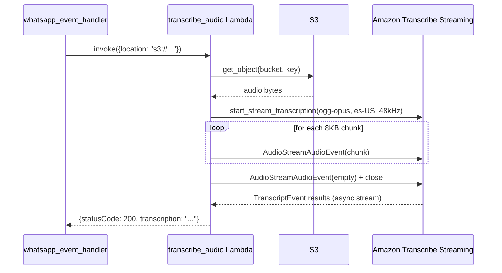

# Design Document: Transcribe Client Migration

## Overview

This migration replaces the deprecated `amazon-transcribe` SDK with the new `aws-sdk-transcribe-streaming` (v0.3.0) in the `transcribe_audio` Lambda. The change is scoped to three files: `transcribe.py` (main logic), `project_layers.py` (CDK layer description), and the layer zip itself. The Lambda handler (`lambda_function.py`) remains untouched since the `TranscribeService` public interface is preserved.

The new SDK uses a different client initialization pattern (explicit `Config` object), a different event model for sending audio (`AudioStreamAudioEvent`), and a different output stream consumption pattern (`async for` iteration). The core flow — read S3 object → stream chunks to Transcribe → collect non-partial results → return joined text — stays the same.

## Architecture

The architecture is unchanged. The `transcribe_audio` Lambda is invoked synchronously by `whatsapp_event_handler` with an S3 location. It streams the audio to Amazon Transcribe Streaming and returns the transcription text.



## Components and Interfaces

### TranscribeService (transcribe.py)

The class interface remains identical. Internal implementation changes:

| Method | Change |
|--------|--------|
| `__init__` | Replace `TranscribeStreamingClient(region=REGION)` with new `TranscribeStreamingClient(config=Config(...))` |
| `parse_s3_location` | No change |
| `get_s3_object` | No change |
| `basic_transcribe` | Rewrite: new input model, new audio event wrapping, new output stream handling |
| `transcribe` | No change (sync wrapper) |

### MyEventHandler → inline logic

The old `MyEventHandler` subclass of `TranscriptResultStreamHandler` is replaced by a standalone async function that iterates over the output stream. The new SDK doesn't provide a base handler class to subclass — instead you iterate `async for event in output_stream` and check `isinstance(event.value, TranscriptEvent)`.

### Import Changes

Old imports removed:
```python
from amazon_transcribe.client import TranscribeStreamingClient
from amazon_transcribe.handlers import TranscriptResultStreamHandler
from amazon_transcribe.model import TranscriptEvent
from amazon_transcribe.utils import apply_realtime_delay
```

New imports added:
```python
from aws_sdk_transcribe_streaming.client import TranscribeStreamingClient, StartStreamTranscriptionInput
from aws_sdk_transcribe_streaming.config import Config
from aws_sdk_transcribe_streaming.models import AudioEvent, AudioStreamAudioEvent, TranscriptEvent
from smithy_aws_core.identity import EnvironmentCredentialsResolver
```

### Client Initialization

```python
# Old
self.transcribe_client = TranscribeStreamingClient(region=REGION)

# New
self.transcribe_client = TranscribeStreamingClient(
    config=Config(
        endpoint_uri=f"https://transcribestreaming.{REGION}.amazonaws.com",
        region=REGION,
        aws_credentials_identity_resolver=EnvironmentCredentialsResolver(),
    )
)
```

### Stream Start

```python
# Old
stream = await self.transcribe_client.start_stream_transcription(
    language_code="es-US",
    media_sample_rate_hz=SAMPLE_RATE,
    media_encoding="ogg-opus",
)

# New
stream = await self.transcribe_client.start_stream_transcription(
    input=StartStreamTranscriptionInput(
        language_code="es-US",
        media_sample_rate_hertz=SAMPLE_RATE,
        media_encoding="ogg-opus",
    )
)
```

### Audio Chunk Sending

```python
# Old
await stream.input_stream.send_audio_event(audio_chunk=chunk)
await stream.input_stream.end_stream()

# New
await stream.input_stream.send(AudioStreamAudioEvent(value=AudioEvent(audio_chunk=chunk)))
# End of stream:
await stream.input_stream.send(AudioStreamAudioEvent(value=AudioEvent(audio_chunk=b"")))
await asyncio.sleep(0.4)
await stream.input_stream.close()
```

### Event Handling

```python
# Old
handler = MyEventHandler(stream.output_stream)
await asyncio.gather(write_chunks(), handler.handle_events())
return " ".join(handler.transcript)

# New
_, output_stream = await stream.await_output()

async def handle_events():
    transcript = []
    async for event in output_stream:
        if isinstance(event.value, TranscriptEvent):
            results = event.value.transcript.results
            for result in results:
                if not result.is_partial:
                    for alt in result.alternatives:
                        transcript.append(alt.transcript)
    return transcript

results = await asyncio.gather(write_chunks(), handle_events())
return " ".join(results[1])
```

### CDK Layer Update (project_layers.py)

The `TranscribeClient` construct description is updated to reference the new package. The layer zip path remains `./layers/transcribe-client.zip` — the zip contents change but the CDK code only needs a description update.

## Data Models

No data model changes. The Lambda input/output contract is preserved:

**Input:**
```json
{"location": "s3://bucket-name/path/to/audio.ogg"}
```

**Output:**
```json
{"statusCode": 200, "transcription": "transcribed text here"}
```

Internal data flow remains: S3 bytes → 8KB chunks → Transcribe stream → transcript strings → joined result.


## Correctness Properties

*A property is a characteristic or behavior that should hold true across all valid executions of a system — essentially, a formal statement about what the system should do. Properties serve as the bridge between human-readable specifications and machine-verifiable correctness guarantees.*

### Property 1: Endpoint URI construction

*For any* valid AWS region string, the constructed endpoint URI should equal `"https://transcribestreaming.{region}.amazonaws.com"`.

**Validates: Requirements 1.1**

### Property 2: S3 URI parsing round trip

*For any* valid S3 URI of the form `s3://{bucket}/{key}` where bucket is non-empty and key is a non-empty path, `parse_s3_location` should return the exact bucket name and the exact object key (everything after the bucket).

**Validates: Requirements 5.4**

### Property 3: Non-partial result collection and joining

*For any* sequence of transcript results containing a mix of partial (`is_partial=True`) and non-partial (`is_partial=False`) results, the event handler should collect only the non-partial transcript texts and join them with spaces. The output should contain none of the partial result texts.

**Validates: Requirements 4.2, 4.3**

## Error Handling

| Scenario | Behavior |
|----------|----------|
| New client initialization failure | Exception propagates to caller (Req 1.3) |
| S3 `get_object` failure | `ClientError` propagates — no change from current behavior |
| Transcribe stream start failure | Exception propagates from `start_stream_transcription` |
| Audio chunk send failure | Exception propagates from `stream.input_stream.send()` |
| Empty S3 object (no audio data) | No chunks sent, empty transcript returned |
| No non-partial results received | Empty string returned (join of empty list) |

No new error handling logic is introduced. The migration preserves the existing "let it fail" approach where exceptions propagate to the Lambda handler and result in a Lambda error response.

## Testing Strategy

### Unit Tests

Unit tests verify specific migration correctness through mocking:

- **Client initialization**: Mock `TranscribeStreamingClient` constructor, verify `Config` object has correct `endpoint_uri`, `region`, and `EnvironmentCredentialsResolver`
- **Stream start parameters**: Mock client, verify `StartStreamTranscriptionInput` is called with `es-US`, `ogg-opus`, `48000`
- **Audio event wrapping**: Mock input stream, verify chunks are wrapped in `AudioStreamAudioEvent(value=AudioEvent(audio_chunk=...))`
- **End-of-stream sequence**: Mock input stream, verify empty chunk → sleep → close sequence
- **Lambda response format**: Verify `{statusCode: 200, transcription: "..."}` structure
- **CDK layer description**: Synth test verifying layer description references new SDK

### Property-Based Tests

Property-based tests use `hypothesis` (Python PBT library) with minimum 100 iterations per property.

- **Property 1** (endpoint URI): Generate random region strings, verify URI pattern
  - Tag: `Feature: transcribe-client-migration, Property 1: Endpoint URI construction`
- **Property 2** (S3 URI parsing): Generate random bucket/key combinations, verify round-trip extraction
  - Tag: `Feature: transcribe-client-migration, Property 2: S3 URI parsing round trip`
- **Property 3** (result collection): Generate random sequences of partial/non-partial transcript results, verify only non-partial texts appear in output joined by spaces
  - Tag: `Feature: transcribe-client-migration, Property 3: Non-partial result collection and joining`

Each property test is a single test function implementing exactly one correctness property from the design document. Property tests complement unit tests: unit tests verify specific integration points and mocked call sequences, while property tests verify universal behavioral guarantees across many generated inputs.
