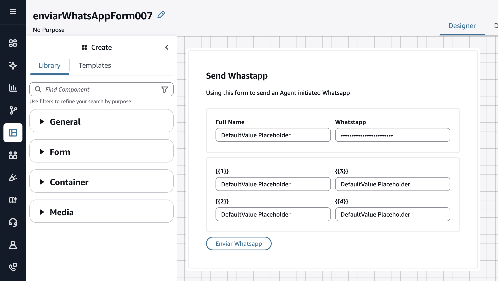
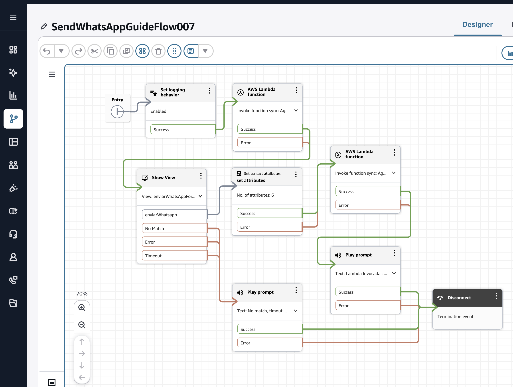
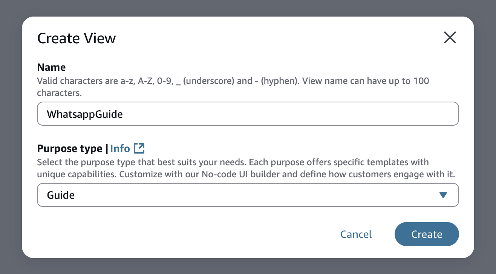
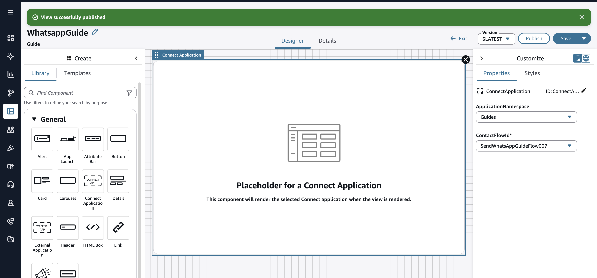
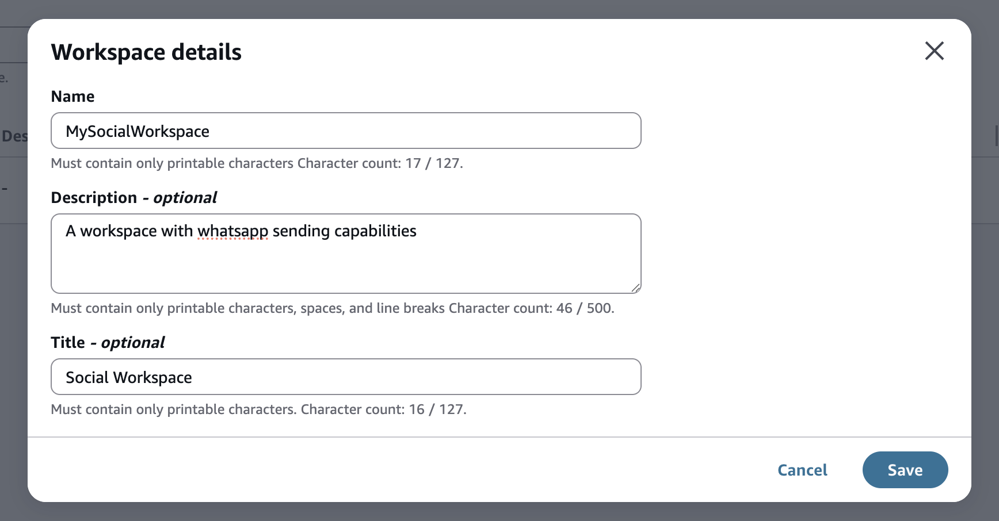
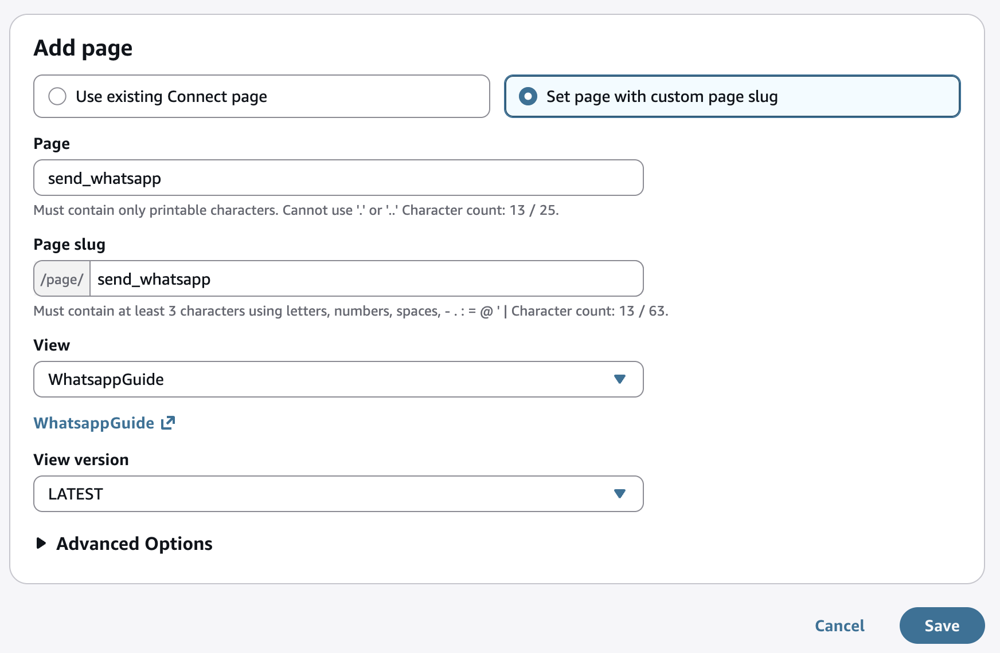
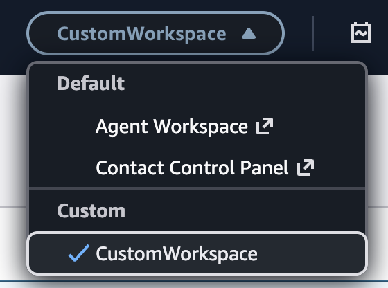

# Agent-Initiated WhatsApp Messages

AWS CDK project that enables Amazon Connect agents to send WhatsApp template messages directly from the Agent Workspace using AWS End User Messaging Social.

## Prerequisites

- A WhatsApp Business Account in AWS End User Messaging
- An Amazon Connect Instance (INSTANCE_ID)
- A WhatsApp Message Template created in End User Messaging (see [Template Creation Guide](../general_template_creation.md))

For the detailed instructions follow the [prerequisites guide](../general_connect_eum.md)

## Architecture


## How It Works

This solution creates a guided experience in the Amazon Connect Agent Workspace that allows agents to send WhatsApp template messages to customers.

### Flow Overview

1. An Amazon Connect Contact Flow invokes a Lambda function (`get_customer_data`) to retrieve customer information (name, phone number, etc.)
2. The flow presents a form (View) in the Agent Workspace pre-filled with customer data
3. The agent reviews and optionally edits the template parameters, then submits the form
4. A second Lambda function (`send_whatsapp_message`) sends the WhatsApp template message via AWS End User Messaging Social API

### Components

- **Contact Flow**: Orchestrates the agent experience, invoking Lambdas and displaying the form
- **View (Form)**: A custom form in the Agent Workspace where agents can review customer data and template parameters before sending
- **get_customer_data Lambda**: Retrieves customer information to pre-fill the form (replace with your own data source)
- **send_whatsapp_message Lambda**: Reads template configuration from SSM Parameter Store and sends the WhatsApp message using the Social Messaging API
- **SSM Parameter**: Stores the WhatsApp template configuration (template name, language, origination phone number)

## Deployment

⚠️ Important: Deploy in the same region as your AWS End User Messaging WhatsApp numbers.

### 1. Update the Connect Instance ID

Before deploying, edit [`config.py`](./config.py) and set your Amazon Connect Instance ID:

```python
INSTANCE_ID = "<your-connect-instance-id>"
```

### 2. Clone and navigate to the project folder

```bash
git clone https://github.com/aws-samples/sample-whatsapp-end-user-messaging-connect-chat.git
cd sample-whatsapp-end-user-messaging-connect-chat/agent-initiated-whatsapp
```

### 3. Follow the CDK deployment instructions

Deployment instructions follow [CDK Deployment Guide](../general_cdk_deploy.md).

## After Deployment

### Step 1: Update the SSM Parameter

Go to the AWS Systems Manager Parameter Store and update `/whatsapp_template/config` with your template name, language code, and origination phone number ID:

```json
{
  "message": {
    "messaging_product": "whatsapp",
    "to": "PHONE_NUMBER",
    "recipient_type": "individual",
    "type": "template",
    "template": {
      "name": "your_template_name",
      "language": { "code": "en_US" },
      "components": [
        {
          "type": "body",
          "parameters": []
        }
      ]
    }
  },
  "META_API_VERSION": "v23.0",
  "ORIGINATION_PHONE_NUMBER_ID": "<your-origination-phone-number-id>"
}
```

| Parameter | Description |
|---|---|
| `template.name` | The name of your WhatsApp template created in End User Messaging. See [Template Creation Guide](../general_template_creation.md) |
| `template.language.code` | Language code of the template (e.g., `en_US`, `es`) |
| `ORIGINATION_PHONE_NUMBER_ID` | The phone number ID from AWS End User Messaging Social |
| `META_API_VERSION` | Meta API version (default: `v23.0`) |

### Step 2: Explore the Deployed Form

Go to your Amazon Connect console and navigate to the deployed view:

```
https://<your-instance>.my.connect.aws/views
```

Look for the view named `enviarWhatsAppForm007`. This is the form agents will use to review customer data and send the WhatsApp message.



_Note that whatsapp field is type password to hide it._

### Step 3: Update the Deployed Contact Flow

Navigate to the deployed contact flow `SendWhatsAppGuideFlow007` in your Amazon Connect console.



#### 3.1 Configure the first Lambda (Get Customer Data)

Edit the first **Invoke AWS Lambda function** block and select the pre-deployed Lambda function. Look for the one containing `GetCustomerData` in the function ARN.

This is a mock function that returns sample customer data:

```python
def lambda_handler(event, context):
    return {
        "fullName": "John Doe", # Use your name
        "phoneNumber": "+XXXXXXXX", #Use your number to test
        "input4": "Entregado",
        "input3": "Puzzle 1000 piezas",
        "input2": "P12345",
        "input1": "John",
    }
```

Replace this with your own data source. For example, you could use a data dip to Amazon Connect Customer Profiles using a `profileId` to match a customer, query a DynamoDB table, or call an external API.

Press **Confirm** to save.

#### 3.2 Configure the Show View block

Edit the **Show view** block and select `enviarWhatsAppForm007` as the view resource.

Notice how the input default values are mapped from the Lambda's returned values:

- `fullName` → `$.External.fullName`
- `whatsappNumber` → `$.External.phoneNumber`
- `input1` through `input4` → `$.External.input1` through `$.External.input4`

These values pre-fill the form so the agent can review them before sending. Press **Confirm** to save.

#### 3.3 Configure the second Lambda (Send WhatsApp Message)

Edit the second **Invoke AWS Lambda function** block and select the pre-deployed Lambda containing `SendWhatsappMessage` in the function ARN.

This Lambda reads the template configuration from SSM, extracts the form values from contact attributes, and sends the WhatsApp message:

```python
def lambda_handler(event, context):
    # Load template config from SSM Parameter Store
    config = get_ssm_parameter(CONFIG_PARAM_NAME)
    message_payload = config["message"]

    # Extract form values from contact attributes
    attributes = event["Details"]["ContactData"]["Attributes"]
    phone_number = attributes.get("phoneNumber") 

    # Build template parameters from input1..input4
    template_params = build_template_parameters(attributes, ["input1", "input2", "input3", "input4"])

    # Send via AWS End User Messaging Social
    response = social_client.send_whatsapp_message(
        originationPhoneNumberId=origination_phone_number_id,
        message=bytes(json.dumps(message_payload), "utf-8"),
        metaApiVersion=meta_api_version,
    )
    return {"result": "OK", "messageId": response.get("messageId", "")}
```

Press **Confirm** to save. Then **Save** and **Publish** the contact flow.

### Step 4: Create a New View (Guide)

Navigate to your Amazon Connect views:

```
https://<your-instance>.my.connect.aws/views
```

Create a new view of type **Guide**.



#### 4.1 Add a Connect Application component

Drag a single **Connect Application** component onto the canvas.

#### 4.2 Configure the component

Set the `contactFlowId` to the deployed contact flow `SendWhatsAppGuideFlow007`.



#### 4.3 Name and Publish

Give the view a name and click **Publish**.

### Step 5: Create a Custom Workspace

#### 5.1 Create the workspace

Navigate to your Amazon Connect workspaces:

```
https://<your-instance>.my.connect.aws/workspaces
```

Click **Add new workspace** and fill in the name, description, and title.



Assign this workspace to users or routing profiles as needed.

#### 5.2 Add a page with the guide

Add a new page using **Set page with custom page slug** and select the view you created in previous Step (the one with the Connect Application component).

Use a custom slug like:

```
/page/send_whatsapp
```


Save the page.

#### 5.3 Navigate to the custom workspace

Select your custom workspace from the top navigation bar in the Agent Workspace.



The agent can now navigate to the custom page and use the guide to send WhatsApp template messages to customers.

## Demo

When the agent navigates to the custom page, they are presented with a Connect Application, which executes the contact flow. The flow displays the form with pre-populated values from the customer data Lambda, giving the agent the opportunity to review, modify, and send. Once the agent submits, the send WhatsApp Lambda is invoked with all the form parameters to deliver the final message.


<div align="center">
<video width="540" controls>
  <source src="https://github.com/user-attachments/assets/251a757c-2fe8-4875-966f-32d2bb7c3aa7" type="video/mp4">
</video>
</div>
