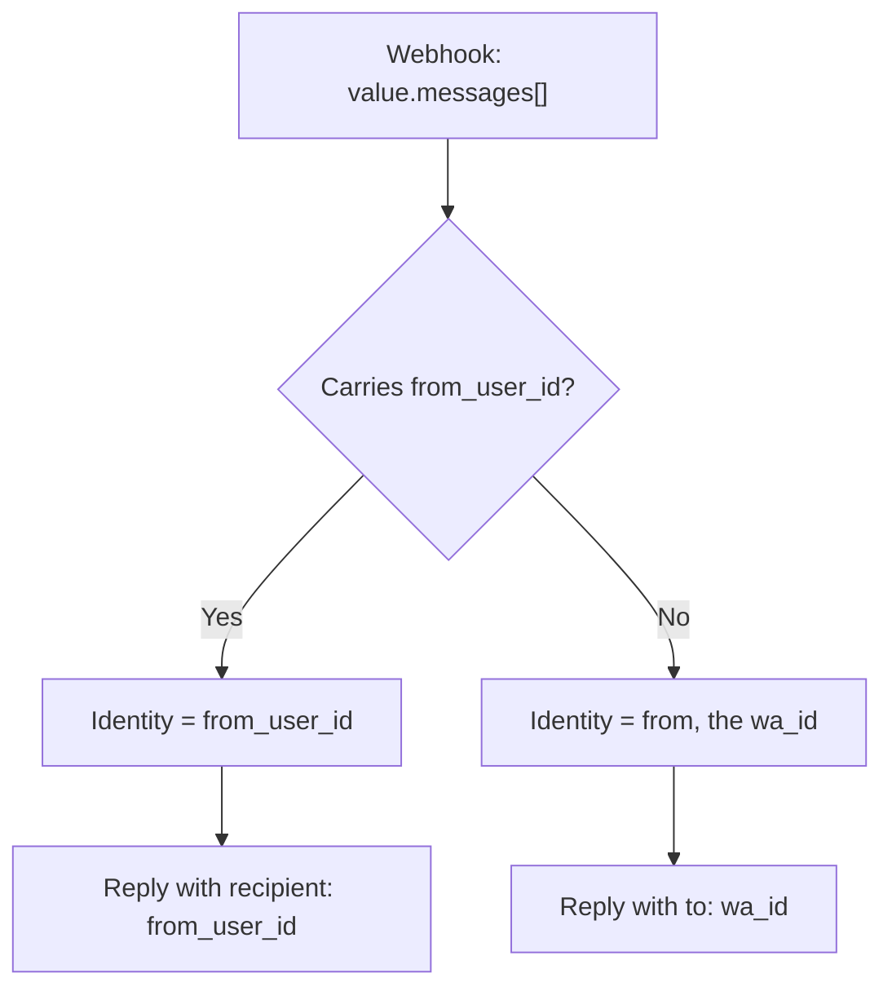

# Handling WhatsApp Business-Scoped User IDs (BSUID)

   _This guide covers the specific changes for WhatsApp Business-Scoped User IDs (BSUID) in the Amazon Connect Chat and AWS End User Messaging Social integration._

## Prerequisite

This guide assumes you already know and have deployed the bidirectional WhatsApp with Amazon Connect Chat solution: the AWS End User Messaging Social webhook publishing to Amazon SNS, the buffering in DynamoDB, the `active_connections` table holding the chat session, and the inbound and outbound Lambda functions. Everything that follows is a targeted modification on top of that base, not a new solution.

If you are not familiar with it yet, start with [Bidirectional WhatsApp – Amazon Connect Chat](https://github.com/aws-samples/sample-whatsapp-end-user-messaging-connect-chat/blob/main/whatsapp-eum-connect-chat/bidirectional_whatsapp.md), which covers the architecture, the WhatsApp Business Account and Amazon Connect instance prerequisites, the CDK deployment, and the post-deployment configuration.

## What changed: usernames and BSUID

WhatsApp is rolling out **usernames**, an optional feature that lets a user display a username instead of their phone number. Once a user adopts one, [their number may stop appearing in webhook payloads](https://developers.facebook.com/documentation/business-messaging/whatsapp/business-scoped-user-ids/#phone-numbers): Meta only keeps including it when certain conditions are met, which we'll cover below.

Here is an example of an incoming webhook from a user who has a BSUID and whose number is still available. It is the fixture kept in the repo as [`lambdas/code/on_raw_messages/entry.json`](https://github.com/aws-samples/sample-whatsapp-end-user-messaging-connect-chat/blob/main/whatsapp-eum-connect-chat/lambdas/code/on_raw_messages/entry.json), and it matches the *entry* as it arrives inside `whatsAppWebhookEntry` in the Amazon SNS notification, not the full Meta payload with `object` and `entry`:

```json
{
  "id": "XXXXXXXXXXXXX",
  "changes": [
    {
      "value": {
        "messaging_product": "whatsapp",
        "metadata": {
          "display_phone_number": "XXXXXXXXXX",
          "phone_number_id": "XXXXXXXXXXXXXX"
        },
        "contacts": [
          {
            "profile": { "name": "Kike" },
            "wa_id": "XXXXXXXXX",
            "user_id": "US.XXXXXXXXXXXXXXX"
          }
        ],
        "messages": [
          {
            "from": "XXXXXXXXX",
            "from_user_id": "US.XXXXXXXXXXXXXXX",
            "id": "wamid.XXXXXXXXXXXXXXXXXXXXXXXXXXXXX=",
            "timestamp": "1787204895",
            "text": { "body": "Hola" },
            "type": "text"
          }
        ]
      },
      "field": "messages"
    }
  ]
}
```

### Which identifier arrives, and when

| Field | User has a username | User does not have a username |
|---|---|---|
| `messages[].from` (phone number) | Only if the number is available per Meta's conditions | Always included |
| `messages[].from_user_id` (BSUID) | Always included | Always included |
| `contacts[].wa_id` (phone number) | Only if available | Always included |
| `contacts[].user_id` (BSUID) | Always included | Always included |
| `contacts[].profile.username` | Always included | Not included |

Meta still shares the number in some cases: if you sent or received a message or call to or from that number within the last 30 days, or if the user is in your contact book. In practice this means you **can't rely on the number being there, nor on it being absent.**


In this guide you'll see the changes made to [WhatsApp End User Messaging + Amazon Connect Chat](https://github.com/aws-samples/sample-whatsapp-end-user-messaging-connect-chat) to support BSUID end to end.


## Inbound handling of a BSUID or a phone number

In [on_raw_messages](https://github.com/aws-samples/sample-whatsapp-end-user-messaging-connect-chat/blob/main/whatsapp-eum-connect-chat/lambdas/code/on_raw_messages/lambda_function.py):

Detect whether an incoming message carries a BSUID (`from_user_id`) or only a phone number (`from`)

```python 
from_phone_number = message.get("from")
from_user_id = message.get("from_user_id")

# Identity mode: user_id when available, phone number otherwise.
if from_user_id:
    item["from"] = from_user_id
    contact_key, contact_value = "user_id", from_user_id
else:
    item["from"] = from_phone_number
    contact_key, contact_value = "wa_id", from_phone_number

item["from_phone_number"] = from_phone_number
if from_user_id:
    item["from_user_id"] = from_user_id
```

Note that `from` can now hold either the wa_id (phone number) or the user_id.


## Sending: `to` vs `recipient`

On the sending side, Meta added a `recipient` property next to the existing `to`:

```json
{
  "messaging_product": "whatsapp",
  "recipient_type": "individual",
  "to": "<USER_PHONE_NUMBER>",
  "recipient": "<BSUID>",
  "type": "text",
  "text": { "body": "<BODY_TEXT>" }
}
```

You can include both, in which case `to` takes precedence. This solution sends exactly one of the two: it is cleaner and makes the identity mode in use explicit in the payload.

> **Check your Meta API version.** BSUIDs started appearing in webhooks in April 2026, but the API did not accept a BSUID as a destination until July 2026. The solution pins the version in `META_API_VERSION` inside [`config.py`](https://github.com/aws-samples/sample-whatsapp-end-user-messaging-connect-chat/blob/main/whatsapp-eum-connect-chat/config.py), and that value travels as `metaApiVersion` on every `send_whatsapp_message` call. Before deploying, confirm the configured version accepts the `recipient` property: if you send `recipient` against a version older than BSUID support, the message won't reach its destination.

### Replying to the WhatsApp user

In [connect_event_handler](https://github.com/aws-samples/sample-whatsapp-end-user-messaging-connect-chat/tree/main/whatsapp-eum-connect-chat/lambdas/code/connect_event_handler) we check whether we are dealing with a phone number:

```python 
# A phone number destination is only digits, optionally prefixed with "+".
PHONE_NUMBER_PATTERN = re.compile(r"^\+?\d+$")


def get_recipient(destination):
    """Destination field for a send_whatsapp_message payload.

    active_connections stores whatever identified the customer: a WhatsApp
    user_id (e.g. "US.XXXXXXXXXXXXXXX") or a phone number. user_id
    destinations are addressed with "recipient", phone numbers with "to".

    (full note in the repo)
    """
    destination = str(destination or "").strip()
    if not destination:
        return {}
    if PHONE_NUMBER_PATTERN.match(destination):
        return {"to": f"+{destination.lstrip('+')}"}
    return {"recipient": destination}
```

If it is a phone number, the field to use is the traditional `{"to":"XXX"}`, otherwise it is `{"recipient":"YYY"}`, and then the message goes out to the user:

```python 
def send_whatsapp_text(text_message, to, phone_number_id, meta_api_version=META_API_VERSION):
    print("sending message...")
    message_object = {
        "messaging_product": "whatsapp",
        "recipient_type": "individual",
        "type": "text",
        "text": {"preview_url": False, "body": text_message},
    }
    message_object.update(get_recipient(to))

    kwargs = dict(
        originationPhoneNumberId=phone_number_id,
        metaApiVersion=meta_api_version,
        message=bytes(json.dumps(message_object), "utf-8"),
    )
    print(kwargs)
    response = socialessaging.send_whatsapp_message(**kwargs)
    print("replied to message:", response)
```

One important detail on the AWS side: **AWS End User Messaging Social passes the message body through as-is.** The `send_whatsapp_message` API takes the Meta payload as raw bytes.
So there is no AWS-side API change to adopt.

### Two places decide the destination, with different criteria

Worth knowing: the solution has two `get_recipient` functions, and they don't apply the same rule.

- In [whatsapp_event_handler](https://github.com/aws-samples/sample-whatsapp-end-user-messaging-connect-chat/blob/main/whatsapp-eum-connect-chat/lambdas/code/whatsapp_event_handler/whatsapp.py) (reactions, read receipts, and the reply carrying a voice note transcription) the decision is based on **field presence**: if the message carries `from_user_id`, use `recipient`; otherwise `to`. It has the webhook at hand, so it doesn't need to guess.
- In [connect_event_handler](https://github.com/aws-samples/sample-whatsapp-end-user-messaging-connect-chat/blob/main/whatsapp-eum-connect-chat/lambdas/code/connect_event_handler/whatsapp.py) (agent messages and attachments) the decision is based on **the shape of the value**, using the `^\+?\d+$` regex. There is no webhook here: all that's left is the value stored in `active_connections`, and that value doesn't say which identity mode produced it.

The inference works because a BSUID always starts with an ISO 3166 alpha-2 country code and a period, which a phone number never does. But it is still an inference. The more robust option is to **persist the identity mode** alongside the session: store `from_user_id` as its own attribute in `active_connections` (next to the `customerId` already used as the lookup key) and have the sending side read that attribute instead of deducing it from the string. As a bonus, that frees up `from_phone_number` to enrich the customer profile whenever Meta does share the number.


## The BSUID is not forever: phone number changes

One detail to keep in mind if you are going to use the BSUID as the customer identity: **the BSUID is regenerated when the user changes their phone number.** Meta reports it on the same `messages` webhook, through a [`type: "system"`](https://developers.facebook.com/documentation/business-messaging/whatsapp/business-scoped-user-ids/#system-messages-webhooks) message:

- `system.type` is `user_changed_number` if Meta can share the new number, or `user_changed_user_id` if it can only report the BSUID change
- `system.user_id` carries the new BSUID
- `system.previous_user_id` carries the old one, which is exactly the piece that lets you reconcile the identity you already had on file

This solution does not process `system` messages yet: they land in the raw messages table, but the aggregator doesn't propagate the `system` object downstream. In practice that means that after a number change, the open session in `active_connections` stays indexed by a BSUID that no longer exists, and the customer's next message opens a new contact in Amazon Connect instead of continuing the conversation.

If your use case depends on keeping the thread, the change is contained: handle `type: "system"` on the inbound side and, using `previous_user_id`, update the open session's `customerId` to the new BSUID or close it cleanly. The same applies to your CRM or Customer Profiles: if you store the BSUID as a customer attribute, this webhook is what keeps it current.


## Architecture


The architecture does not change with BSUID. No new resources, no new tables, no schema migration. The flow is still:

1. AWS End User Messaging Social publishes the WhatsApp webhook to an Amazon SNS topic
2. `on_raw_messages` writes each message to the `raw_messages` DynamoDB table
3. DynamoDB Streams with an aggregation window triggers `message_aggregator`, which buffers and concatenates consecutive messages
4. `whatsapp_event_handler` starts or continues the Amazon Connect Chat session
5. Amazon Connect sends agent messages to SNS, and `connect_event_handler` forwards them to WhatsApp

What changed is **the value that flows as the customer identity**, and the two places that turn that value into a destination. We recommend adopting this identity as an additional attribute in your CRM or in [Customer Profiles](https://aws.amazon.com/products/connect/customer/customer-profiles/).


## Decision flow: identity and destination



If `from_user_id` is present, that is the customer identifier and the reply is addressed with `recipient`. If it isn't, the identity is the `wa_id` and you reply with `to`.

## BSUID limits worth knowing

These points don't change the integration code, but they do shape how far you can take BSUID-based identity. All of them come from Meta's documentation, linked to the exact section:

| Detail | What it means for your integration | Source |
|---|---|---|
| One-tap, zero-tap, and copy code authentication templates don't accept a BSUID as destination: they require a phone number | If your outbound flow sends OTPs through those templates, you need the number; the error returned is `131062` | [Business-scoped user ID](https://developers.facebook.com/documentation/business-messaging/whatsapp/business-scoped-user-ids/#business-scoped-user-id) and [Error codes](https://developers.facebook.com/documentation/business-messaging/whatsapp/business-scoped-user-ids/#error-codes) |
| There is a *parent BSUID* (`from_parent_user_id`) for businesses with several enrolled portfolios | This solution doesn't use it, and doesn't need to: the regular BSUID still works within your portfolio | [Parent business-scoped user IDs](https://developers.facebook.com/documentation/business-messaging/whatsapp/business-scoped-user-ids/#parent-business-scoped-user-ids) |
| The BSUID is regenerated if the user changes their phone number, and it is reported through a `system` message | This is the case described above: reconcile using `previous_user_id` | [System messages webhooks](https://developers.facebook.com/documentation/business-messaging/whatsapp/business-scoped-user-ids/#system-messages-webhooks) |

On the AWS side, the only reference you need is the sending one: the API's `message` field passes the WhatsApp Message object through, which is why `recipient` works without waiting for SDK changes. See [SendWhatsAppMessage](https://docs.aws.amazon.com/social-messaging/latest/APIReference/API_SendWhatsAppMessage.html) in the AWS End User Messaging Social API reference.
