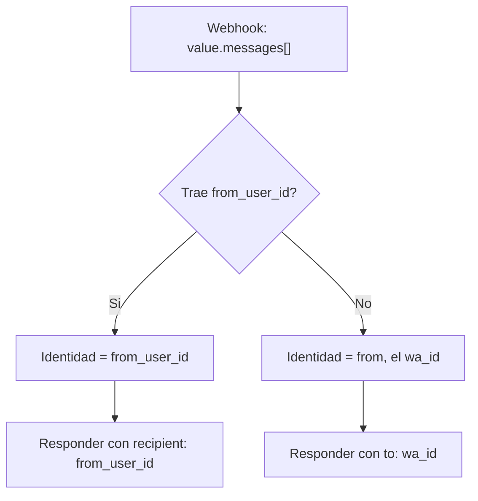

# Cómo manejar Business-Scoped User IDs (BSUID) de WhatsApp 

   _Esta guía cubre los cambios específicos de Business-Scoped User IDs (BSUID) de WhatsApp para la integración con Amazon Connect Chat y AWS End User Messaging Social._

## Prerrequisito

Esta guía asume que ya conoces y tienes desplegada la solución bidireccional de WhatsApp con Amazon Connect Chat: el webhook de AWS End User Messaging Social publicando en Amazon SNS, el buffering en DynamoDB, la tabla `active_connections` que mantiene la sesión de chat, y las funciones Lambda de entrada y salida. Todo lo que sigue son modificaciones puntuales sobre esa base, no una solución nueva.

Si aún no la conoces, empieza por [Bidirectional WhatsApp – Amazon Connect Chat](https://github.com/aws-samples/sample-whatsapp-end-user-messaging-connect-chat/blob/main/whatsapp-eum-connect-chat/bidirectional_whatsapp.md), que cubre la arquitectura, los prerrequisitos de WhatsApp Business Account e instancia de Amazon Connect, el despliegue con CDK y la configuración posterior.

## El cambio: usernames y BSUID

WhatsApp está desplegando **usernames**, una función opcional que permite a un usuario mostrar un nombre de usuario en lugar de su número de teléfono. Cuando un usuario adopta uno, [su número puede dejar de aparecer en los payloads de webhook](https://developers.facebook.com/documentation/business-messaging/whatsapp/business-scoped-user-ids/#phone-numbers): Meta lo sigue incluyendo solo si se cumplen ciertas condiciones, que veremos más abajo.

Este es un ejemplo de webhook entrante de un usuario que tiene BSUID y cuyo número aún está disponible. Es el fixture que quedó en el repo como [`lambdas/code/on_raw_messages/entry.json`](https://github.com/aws-samples/sample-whatsapp-end-user-messaging-connect-chat/blob/main/whatsapp-eum-connect-chat/lambdas/code/on_raw_messages/entry.json), y corresponde al *entry* tal como llega dentro de `whatsAppWebhookEntry` en la notificación de Amazon SNS, no al payload completo de Meta con `object` y `entry`:

```json
{
  "id": "XXXXXXXXXXXXX",
  "changes": [
    {
      "value": {
        "messaging_product": "whatsapp",
        "metadata": {
          "display_phone_number": "XXXXXXXXXX",
          "phone_number_id": "XXXXXXXXXXXXXX"
        },
        "contacts": [
          {
            "profile": { "name": "Kike" },
            "wa_id": "XXXXXXXXX",
            "user_id": "US.XXXXXXXXXXXXXXX"
          }
        ],
        "messages": [
          {
            "from": "XXXXXXXXX",
            "from_user_id": "US.XXXXXXXXXXXXXXX",
            "id": "wamid.XXXXXXXXXXXXXXXXXXXXXXXXXXXXX=",
            "timestamp": "1787204895",
            "text": { "body": "Hola" },
            "type": "text"
          }
        ]
      },
      "field": "messages"
    }
  ]
}
```

### Qué identificador llega, y cuándo

| Campo | El usuario tiene username | El usuario no tiene username |
|---|---|---|
| `messages[].from` (número) | Solo si el número está disponible según las condiciones de Meta | Siempre incluido |
| `messages[].from_user_id` (BSUID) | Siempre incluido | Siempre incluido |
| `contacts[].wa_id` (número) | Solo si está disponible | Siempre incluido |
| `contacts[].user_id` (BSUID) | Siempre incluido | Siempre incluido |
| `contacts[].profile.username` | Siempre incluido | No incluido |

Meta todavía comparte el número en algunos casos: si le enviaste o recibiste un mensaje o llamada de ese número en los últimos 30 días, o si el usuario está en tu contact book. En la práctica esto significa que **no puedes depender de que el número esté, ni de que no esté.**


En esta guía verás los cambios realizados en [WhatsApp End User Messaging + Amazon Connect Chat](https://github.com/aws-samples/sample-whatsapp-end-user-messaging-connect-chat) para soportar BSUID end to end.


## Manejo inbound de BSUID o número telefónico

En [on_raw_messages](https://github.com/aws-samples/sample-whatsapp-end-user-messaging-connect-chat/blob/main/whatsapp-eum-connect-chat/lambdas/code/on_raw_messages/lambda_function.py):

Detecta si un mensaje entrante trae un BSUID (`from_user_id`) o solo un número de teléfono (`from`)

```python 
from_phone_number = message.get("from")
from_user_id = message.get("from_user_id")

# Identity mode: user_id when available, phone number otherwise.
if from_user_id:
    item["from"] = from_user_id
    contact_key, contact_value = "user_id", from_user_id
else:
    item["from"] = from_phone_number
    contact_key, contact_value = "wa_id", from_phone_number

item["from_phone_number"] = from_phone_number
if from_user_id:
    item["from_user_id"] = from_user_id
```

Nota que ahora `from` puede contener el wa_id (número de teléfono) o el user_id.


## Envío: `to` vs `recipient`

Del lado del envío, Meta agregó una propiedad `recipient` junto al `to` existente:

```json
{
  "messaging_product": "whatsapp",
  "recipient_type": "individual",
  "to": "<USER_PHONE_NUMBER>",
  "recipient": "<BSUID>",
  "type": "text",
  "text": { "body": "<BODY_TEXT>" }
}
```

Puedes incluir ambos, en cuyo caso `to` tiene precedencia. Esta solución envía exactamente uno de los dos: es más limpio y deja explícito en el payload cuál modo de identidad se está usando.

> **Revisa tu versión de la API de Meta.** Los BSUID empezaron a aparecer en los webhooks en abril de 2026, pero la API no aceptó BSUID como destino hasta julio de 2026. La solución fija la versión en `META_API_VERSION` dentro de [`config.py`](https://github.com/aws-samples/sample-whatsapp-end-user-messaging-connect-chat/blob/main/whatsapp-eum-connect-chat/config.py), y ese valor viaja como `metaApiVersion` en cada llamada a `send_whatsapp_message`. Antes de desplegar, confirma que la versión configurada acepta la propiedad `recipient`: si envías `recipient` contra una versión anterior al soporte de BSUID, el mensaje no llega a destino.

### Respondiendo al usuario de WhatsApp

En [connect_event_handler](https://github.com/aws-samples/sample-whatsapp-end-user-messaging-connect-chat/tree/main/whatsapp-eum-connect-chat/lambdas/code/connect_event_handler) verificamos si se trata de un número telefónico:

```python 
# A phone number destination is only digits, optionally prefixed with "+".
PHONE_NUMBER_PATTERN = re.compile(r"^\+?\d+$")


def get_recipient(destination):
    """Destination field for a send_whatsapp_message payload.

    active_connections stores whatever identified the customer: a WhatsApp
    user_id (e.g. "US.XXXXXXXXXXXXXXX") or a phone number. user_id
    destinations are addressed with "recipient", phone numbers with "to".

    (nota completa en el repo)
    """
    destination = str(destination or "").strip()
    if not destination:
        return {}
    if PHONE_NUMBER_PATTERN.match(destination):
        return {"to": f"+{destination.lstrip('+')}"}
    return {"recipient": destination}
```

Si es un número telefónico el campo a utilizar es el tradicional `{"to":"XXX"}`, en caso contrario se trata de `{"recipient":"YYY"}` para luego enviar el mensaje al usuario:

```python 
def send_whatsapp_text(text_message, to, phone_number_id, meta_api_version=META_API_VERSION):
    print("sending message...")
    message_object = {
        "messaging_product": "whatsapp",
        "recipient_type": "individual",
        "type": "text",
        "text": {"preview_url": False, "body": text_message},
    }
    message_object.update(get_recipient(to))

    kwargs = dict(
        originationPhoneNumberId=phone_number_id,
        metaApiVersion=meta_api_version,
        message=bytes(json.dumps(message_object), "utf-8"),
    )
    print(kwargs)
    response = socialessaging.send_whatsapp_message(**kwargs)
    print("replied to message:", response)
```

Un detalle importante del lado de AWS: **AWS End User Messaging Social pasa el cuerpo del mensaje tal cual.** La API `send_whatsapp_message` recibe el payload de Meta como bytes crudos.
Por lo tanto no hay ningún cambio de API del lado de AWS que adoptar. 

### Dos lugares deciden el destino, con criterios distintos

Conviene saber que la solución tiene dos funciones `get_recipient`, y no aplican la misma regla:

- En [whatsapp_event_handler](https://github.com/aws-samples/sample-whatsapp-end-user-messaging-connect-chat/blob/main/whatsapp-eum-connect-chat/lambdas/code/whatsapp_event_handler/whatsapp.py) (reacciones, read receipts y la respuesta con la transcripción de una nota de voz) decide por **presencia del campo**: si el mensaje trae `from_user_id`, usa `recipient`; si no, `to`. Tiene el webhook a mano, así que no necesita adivinar.
- En [connect_event_handler](https://github.com/aws-samples/sample-whatsapp-end-user-messaging-connect-chat/blob/main/whatsapp-eum-connect-chat/lambdas/code/connect_event_handler/whatsapp.py) (mensajes y adjuntos del agente) decide por **la forma del valor**, con el regex `^\+?\d+$`. Aquí ya no hay webhook: solo está el valor guardado en `active_connections`, y ese valor no dice con qué modo de identidad se obtuvo.

La inferencia funciona porque un BSUID siempre empieza con el código de país ISO 3166 alpha-2 y un punto, algo que un número de teléfono nunca cumple. Pero sigue siendo una inferencia. La opción más robusta es **persistir el modo de identidad** junto a la sesión: guardar `from_user_id` como atributo propio en `active_connections` (además del `customerId` que ya se usa como clave de búsqueda) y que el envío lea ese atributo en lugar de deducirlo del string. Como beneficio adicional, deja libre el campo `from_phone_number` para enriquecer el perfil del cliente cuando Meta sí comparte el número.


## El BSUID no es eterno: cambios de número

Hay un detalle que conviene tener presente si vas a usar el BSUID como identidad del cliente: **el BSUID se regenera cuando el usuario cambia su número de teléfono.** Meta lo avisa por el mismo webhook `messages`, con un mensaje de [`type: "system"`](https://developers.facebook.com/documentation/business-messaging/whatsapp/business-scoped-user-ids/#system-messages-webhooks):

- `system.type` es `user_changed_number` si Meta puede compartir el número nuevo, o `user_changed_user_id` si solo puede reportar el cambio de BSUID
- `system.user_id` trae el BSUID nuevo
- `system.previous_user_id` trae el anterior, que es justamente la pieza que te permite reconciliar la identidad que ya tenías guardada

Esta solución todavía no procesa mensajes `system`: llegan a la tabla de mensajes crudos, pero el agregador no propaga el objeto `system` aguas abajo. En la práctica eso significa que, tras un cambio de número, la sesión abierta en `active_connections` queda indexada por un BSUID que ya no existe, y el siguiente mensaje del cliente abre un contacto nuevo en Amazon Connect en lugar de continuar la conversación.

Si tu caso de uso depende de mantener el hilo, el cambio a realizar es acotado: manejar `type: "system"` en el inbound y, con `previous_user_id`, actualizar el `customerId` de la sesión abierta al BSUID nuevo o cerrarla de forma ordenada. Vale lo mismo para el CRM o Customer Profiles: si guardas el BSUID como atributo del cliente, este webhook es el que lo mantiene al día.


## Arquitectura


La arquitectura no cambia con respecto al cambio BSUID. Sin recursos nuevos, sin tablas nuevas, sin migración de esquema. El flujo sigue siendo:

1. AWS End User Messaging Social publica el webhook de WhatsApp en un tema de Amazon SNS
2. `on_raw_messages` escribe cada mensaje en la tabla `raw_messages` de DynamoDB
3. DynamoDB Streams con ventana de agregación dispara `message_aggregator`, que hace buffer y concatena mensajes consecutivos
4. `whatsapp_event_handler` inicia o continúa la sesión de Amazon Connect Chat
5. Amazon Connect envía los mensajes del agente a SNS, y `connect_event_handler` los reenvía a WhatsApp

Lo que cambió es **el valor que circula como identidad del cliente**, y los dos lugares que convierten ese valor en un destino. Se recomienda adoptar esta identidad como un atributo adicional en el CRM o en [Customer Profiles](https://aws.amazon.com/products/connect/customer/customer-profiles/).


## Flujo de decisión: identidad y destino



Si viene `from_user_id`, ese es el identificador del cliente y la respuesta se direcciona con `recipient`. Si no viene, la identidad es el `wa_id` y se responde con `to`.

## Límites del BSUID que conviene conocer

Estos puntos no cambian el código de la integración, pero sí condicionan hasta dónde puedes llevar la identidad por BSUID. Todos salen de la documentación de Meta, con el enlace a la sección exacta:

| Detalle | Qué implica en tu integración | Fuente |
|---|---|---|
| Las plantillas de autenticación one-tap, zero-tap y copy code no admiten BSUID como destino: exigen número de teléfono | Si tu flujo saliente manda OTPs por esas plantillas, necesitas el número; el error que devuelve es `131062` | [Business-scoped user ID](https://developers.facebook.com/documentation/business-messaging/whatsapp/business-scoped-user-ids/#business-scoped-user-id) y [Error codes](https://developers.facebook.com/documentation/business-messaging/whatsapp/business-scoped-user-ids/#error-codes) |
| Existe un *parent BSUID* (`from_parent_user_id`) para negocios con varios portfolios enrolados | Esta solución no lo usa, y no hace falta: el BSUID normal sigue sirviendo dentro de tu portfolio | [Parent business-scoped user IDs](https://developers.facebook.com/documentation/business-messaging/whatsapp/business-scoped-user-ids/#parent-business-scoped-user-ids) |
| El BSUID se regenera si el usuario cambia de número, y se notifica con un mensaje `system` | Es el caso descrito más arriba: hay que reconciliar con `previous_user_id` | [System messages webhooks](https://developers.facebook.com/documentation/business-messaging/whatsapp/business-scoped-user-ids/#system-messages-webhooks) |

Del lado de AWS, la única referencia que necesitas es la del envío: el campo `message` de la API hace pass-through del objeto Message de WhatsApp, y por eso `recipient` funciona sin esperar cambios en el SDK. Ver [SendWhatsAppMessage](https://docs.aws.amazon.com/social-messaging/latest/APIReference/API_SendWhatsAppMessage.html) en la referencia de API de AWS End User Messaging Social.
