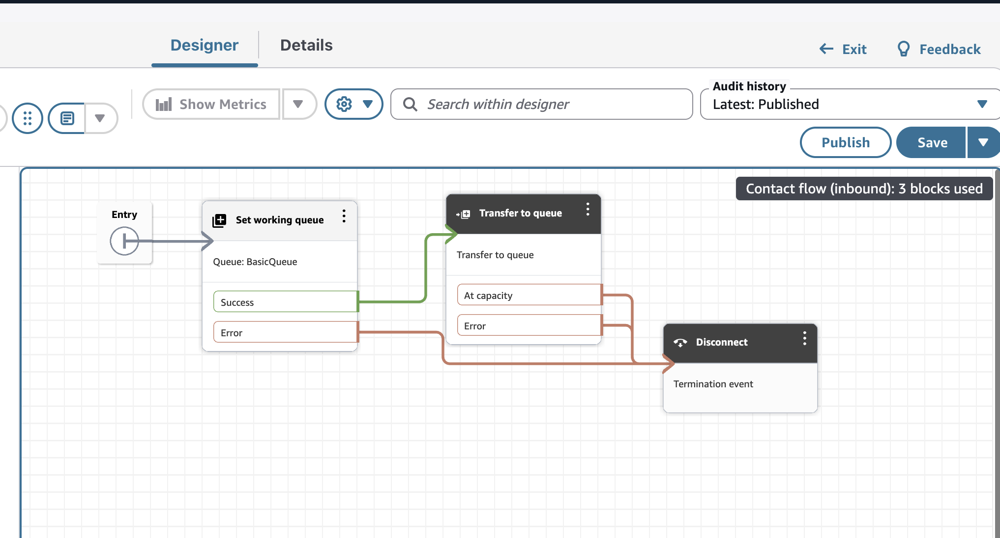

## Prerequisites

### WhatsApp Business Account

To get started, businesses need to either create a new WhatsApp Business Account (WABA) or migrate an existing one to AWS. The main steps are described [here](https://docs.aws.amazon.com/social-messaging/latest/userguide/getting-started.html). In summary:

1. Have or create a Meta Business Account
2. Access AWS End User Messaging Social console and link business account through Facebook embedded portal.
3. Ensure you have a phone number that can receive SMS/voice verification and add it to Whatsapp.

⚠️ Important: Do not use your personal whatsapp number for this.

### An Amazon Connect instance

You need a Amazon Connect Instance. If you don't have one already you can [follow this guide](https://docs.aws.amazon.com/connect/latest/adminguide/amazon-connect-instances.html).

### A Chat Flow to handle messages

Have or create the expected experience a user will have with a contact. [Follow this guide](https://docs.aws.amazon.com/connect/latest/adminguide/create-contact-flow.html) to create an Inbound Contact flow. The simplest one will be ok:

(remember to publish the flow!)

Take note of **INSTANCE_ID** and **CONTACT_FLOW_ID** in the Details tab, values are in flow ARN:

`arn:aws:connect:<region>:<account_id>:instance/INSTANCE_ID/contact-flow/CONTACT_FLOW_ID`
