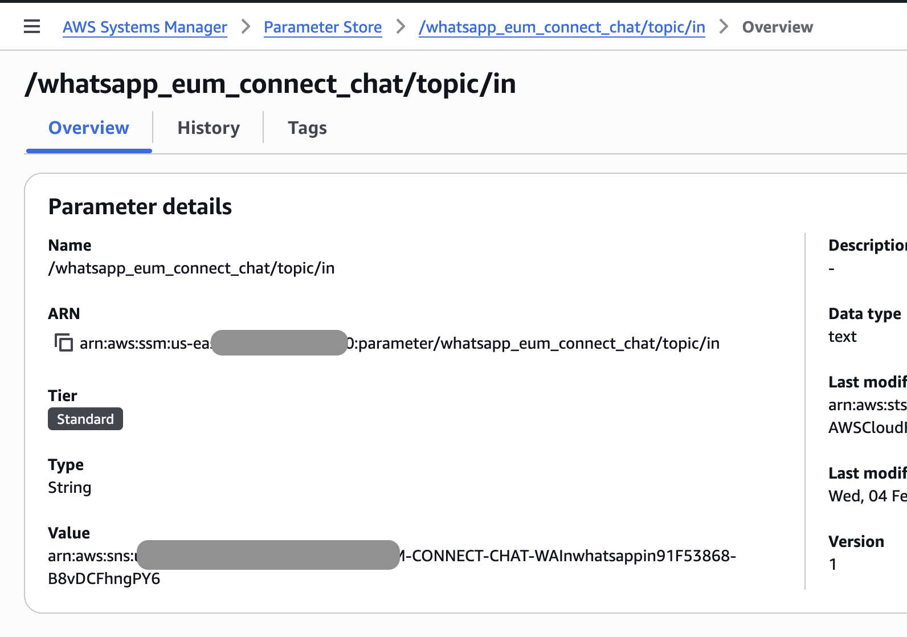

# WhatsApp Buffering Messages

AWS CDK project for managing WhatsApp message buffering with Amazon Connect integration.

## Prerequisites

Besides this deployment, to be able to test bidirectional communication with a user in Whatsapp, you will need:

- A WhatsApp Business Account in AWS End User Messaging
- An Amazon Connect Instance (INSTANCE_ID)
- A Chat Inbound Flow (CONTACT_FLOW_ID)

For the detailed instructions follow the [prerequisites guide](../general_connect_eum.md)

## Architecture


## How Message Buffering Works

This solution uses DynamoDB Streams to buffer and aggregate rapid consecutive WhatsApp messages before forwarding them to Amazon Connect.

### The Problem

When users send multiple messages in quick succession (e.g., "Hello", "How", "are", "you?"), each message triggers a separate webhook event. Without buffering, this creates:
- Multiple Amazon Connect chat messages
- Poor user experience
- Increased costs

### The Solution: Buffering incoming messages

**1. Raw Message Storage**


Incoming WhatsApp messages are stored in a DynamoDB table (`raw_messages`) with:

- Partition key: `from` (sender phone number)
- Sort key: `id` (message ID)
- TTL enabled for automatic cleanup
- DynamoDB Streams enabled with a tumbling window (buffer)

#### Explanation

Storing records using `from` partition key and `id` as sort key guarantee that messages from same user are stored together, then all those records will fall in the same shard to be processed sequentially by the stream. 

In other hand, using a tumbling window serves as buffer to wait specific amount of seconds before invoking the lambda function. Each shard will invoke a lambda, so messages from the same user in that window will be processed altogether.


**2. Stream Processing**

DynamoDB Streams triggers a Lambda function (`message_aggregator`) that:
- Receives batches of new messages from the stream
- Groups messages by sender (`from`)
- Sorts messages by timestamp
- Concatenates consecutive text messages with newlines
- Preserves non-text messages (images, audio, etc.) as separate items

**3. Aggregation Logic**

The aggregator combines messages like:
```
Message 1: Hello
Message 2: How
Message 3: are
Message 4: you?
Message 5: ✌️
```

Into a single aggregated message:
```
Hello
How
are
you?
✌️
```

**4. Forwarding**

Once aggregated, the Lambda invokes the WhatsApp event handler asynchronously, which then creates or updates the Amazon Connect chat session with the combined message from the user.


### Benefits?

- **Natural conversation flow**: Multiple rapid messages appear as one coherent message
- **Cost optimization**: Fewer invocations down the road.
- **Automatic cleanup**: TTL (time to live) removes old messages automatically from raw. Configurable.
- **Scalable**: DynamoDB Streams handles high throughput automatically up to 10000 per stream
- **Reliable**: Stream processing ensures no messages are lost (at-least-once delivery). Configurable retries and Dead Letter Queue (not implemented here)

## Cost Estimation

Example scenario: 
- 1,000 raw messages aggregated into 250 messages (4:1 ratio assumption)
- Messages are answered by a Human, the answer remain the same (same answer costs)


| Component | Without Buffering | With Buffering | Savings |
|---|---|---|---|
| DynamoDB + Streams | — | ~$0.0013 | — |
| Lambda (all functions) | — | ~$0.00078 | — |
| Buffering Infrastructure | $0.00 | ~$0.002 | — |
| Ibound API Calls | 1,000 calls | 250 calls | 75% fewer calls |
| Connect Chat Cost  | $4.00  | $1.00 | $3.00 |
| **Total** | **$4.00** | **~$1** | **~$3(75%)** |

- *Connect Chat cost calculated as $0.004 × msg (in) + $0.004 × msg (out). [see pricing](https://aws.amazon.com/es/end-user-messaging/pricing/)*
- *EUM cost calculated as $0.005 × msg (in) + $0.005 × msg (out).* _[see pricing](https://aws.amazon.com/es/connect/pricing/)_


## Deployment

⚠️ Important: Deploy in the same region as your AWS End User Messaging Whatsapp Numbers.

1. Clone the repository and navigate to the project folder

```bash
git clone https://github.com/aws-samples/sample-whatsapp-end-user-messaging-connect-chat.git
cd sample-whatsapp-end-user-messaging-connect-chat/whatsapp-eum-connect-chat
```
2. deployment instructions follow [CDK Deployment Guide](../general_cdk_deploy.md).


## Configuration

After deployment, update the SSM parameter `/whatsapp_eum_connect_chat/config` with your Amazon Connect details:

```json
{
  "instance_id": "<your-connect-instance-id>",
  "contact_flow_id": "<your-contact-flow-id>",
  "chat_duration_minutes": 60,
  "ignore_reactions": "yes",
  "ignore_stickers": "yes",
}
```


### Add the event destination 

After deploying the stack, use the created SNS topic as your event destination in AWS End user messaging social console. The specific arn will SSM parameter `/whatsapp_eum_connect_chat/topic/in`. Copy the value of the parameter (it start with `arn:aws:sns`)


AWS End user messaging social console, select destination **Amazon SNS** and paste the **Topic ARN** from previous step:


If you want to change the buffer time, edit `BUFFER_IN_SECONDS` in [`config.py`](./config.py) and redeploy. 

## Test whatsapp communication

In order to test, go to your Amazon Connect Instance and [Open Contact control Panel (CCP)](https://docs.aws.amazon.com/connect/latest/adminguide/launch-ccp.html) and send a Whatsapp Message to the EUM Social number.

Try sending a rapid sequence of messages files and see how they arrives to Amazon connect. 

<div align="center">
<video width="540" controls>
  <source src="demo_eum_whatsapp.mp4" type="video/mp4">
</video>
</div>
